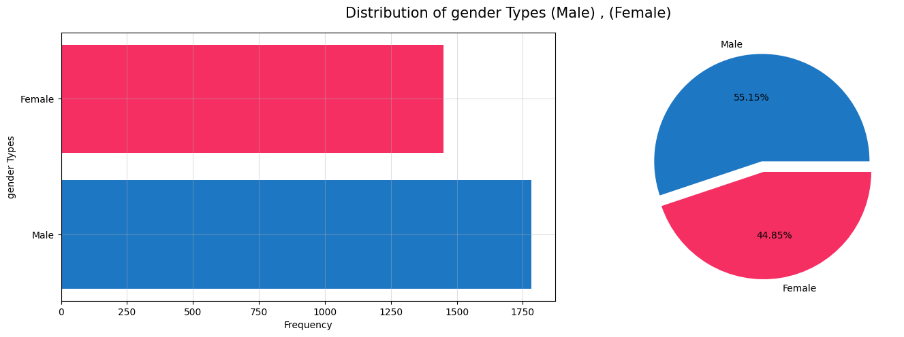
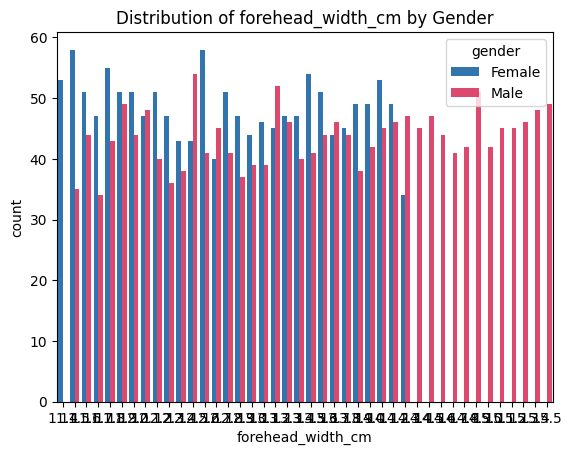
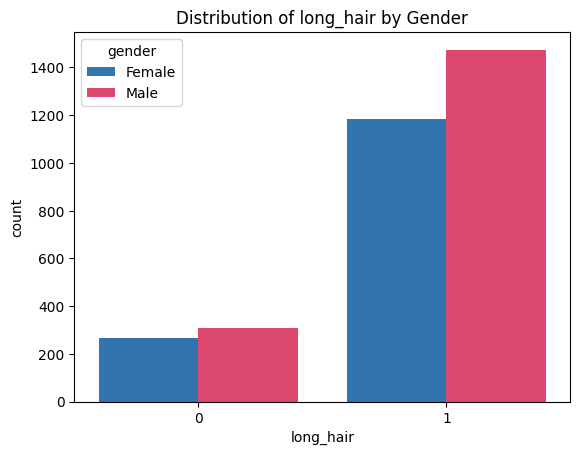
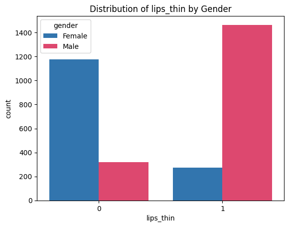
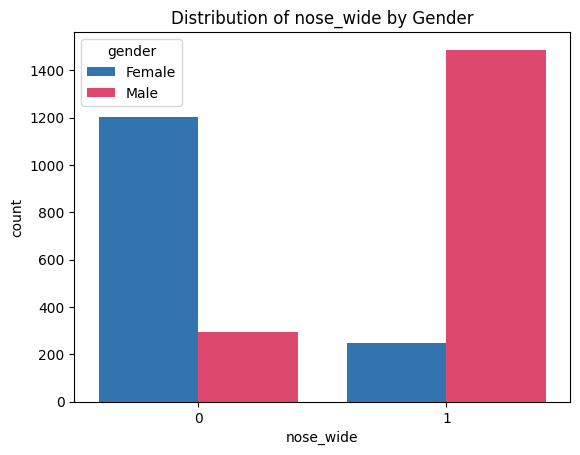
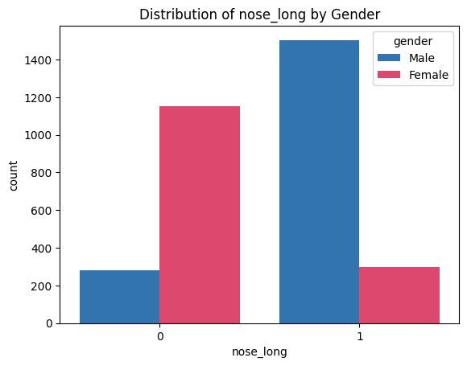
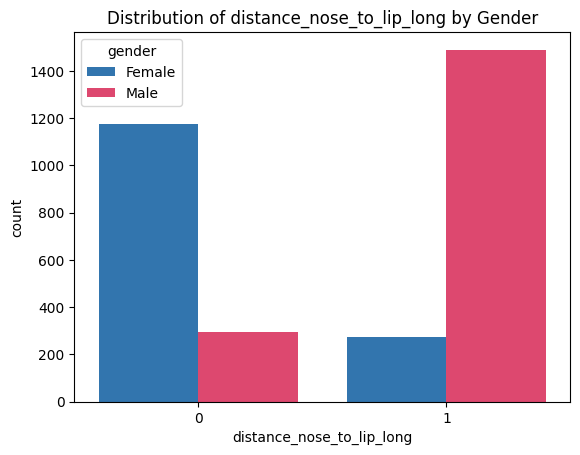
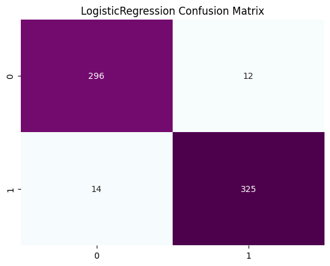
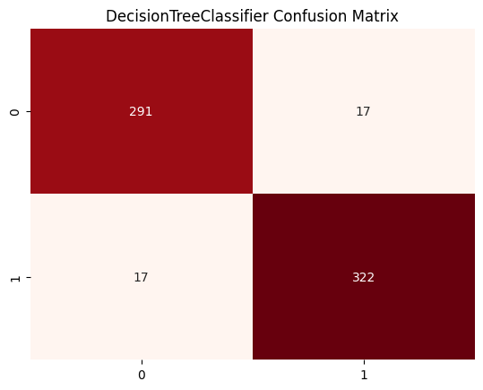

# Laporan Proyek Machine Learning - Musfirotul Khusna

## Domain Proyek

**Latar Belakang**

Klasifikasi gender berdasarkan fitur wajah merupakan topik penting dalam bidang pengenalan pola dan visi komputer (Sofwan Alfaritsi, 2024). Dengan kemajuan teknologi dan meningkatnya kebutuhan akan sistem identifikasi otomatis, kemampuan untuk menentukan gender seseorang melalui analisis fitur wajah menjadi semakin relevan dalam berbagai aplikasi, seperti keamanan, interaksi manusia-komputer, dan pemasaran yang ditargetkan (Hanifa Salsabila, 2021).

Dataset yang digunakan dalam penelitian ini mencakup informasi tentang berbagai fitur wajah, termasuk panjang rambut, lebar dan tinggi dahi, lebar dan panjang hidung, ketebalan bibir, serta jarak antara hidung dan bibir. Fitur-fitur ini dipilih karena menunjukkan perbedaan yang signifikan antara pria dan wanita, sehingga menjadi indikator yang tepat untuk proses klasifikasi gender.

**Tujuan Proyek**

Tujuan utama dari penelitian ini adalah untuk mengembangkan model klasifikasi yang dapat memprediksi gender seseorang berdasarkan fitur-fitur wajah yang tersedia dalam dataset. Dengan memanfaatkan teknik pembelajaran mesin seperti Logistic Regression, Random Forest, Decision Tree, dan K-Nearest Neighbors (KNN), proyek ini bertujuan untuk mengevaluasi efektivitas masing-masing metode dalam konteks klasifikasi gender.

**Signifikansi Proyek**

Proyek ini memiliki signifikansi dalam pengembangan sistem identifikasi otomatis yang lebih akurat dan efisien. Dengan memahami fitur-fitur wajah yang paling berpengaruh dalam menentukan gender, sistem dapat dioptimalkan untuk berbagai aplikasi praktis. Selain itu, proyek ini juga memberikan kontribusi dalam pemahaman lebih lanjut mengenai perbedaan morfologi wajah antara pria dan wanita, yang dapat berguna dalam bidang antropologi dan forensik.

**Daftar Pustaka (Format APA)**:

Hanifa Salsabila, E. R. (2021). Klasifikasi Gender Berdasarkan Citra Wajah Menggunakan Metode Local Binary Pattern dan K-Nearest Neighbor. Jurnal Tugas Akhir Fakultas Informatika, 3137-3146.
Sofwan Alfaritsi, M. H. (2024). IMPLEMENTASI KLASIFIKASI JENIS KELAMIN MENGGUNAKAN PSO DAN EKSTRAKSI FITUR CNN. SENAFTI (Seminar Nasional Mahasiswa Fakultas Teknologi Informasi), 803-810.

## Business Understanding

Proses klarifikasi masalah dalam proyek ini bertujuan untuk memahami tantangan dan kebutuhan utama dalam mengembangkan sistem klasifikasi gender berdasarkan fitur wajah. Analisis ini menjadi dasar dalam merumuskan pernyataan masalah, tujuan, serta solusi yang akan dikembangkan dalam proyek.

Bagian laporan ini mencakup:

### Problem Statements

Menjelaskan pernyataan masalah latar belakang:
- Bagaimana cara mengklasifikasikan jenis kelamin (gender) berdasarkan fitur-fitur yang tersedia dalam dataset dengan tingkat akurasi yang tinggi?
- Algoritma klasifikasi mana yang memberikan performa terbaik dalam memprediksi gender berdasarkan data yang dimiliki?
- Apakah pemodelan machine learning yang diterapkan dapat digunakan sebagai baseline untuk pengembangan aplikasi berbasis klasifikasi gender?

### Goals

Menjelaskan tujuan dari pernyataan masalah:
- Mengembangkan model klasifikasi berbasis machine learning yang dapat mengidentifikasi gender secara akurat berdasarkan data fitur.
- Membandingkan beberapa algoritma seperti Logistic Regression, K-Nearest Neighbors (KNN), Decision Tree, dan Random Forest untuk mengidentifikasi model dengan performa terbaik.
- Menyediakan evaluasi model yang bisa dijadikan baseline bagi pengembangan sistem klasifikasi gender secara otomatis.

    ### Solution statements
    - Menerapkan dan membandingkan empat algoritma klasifikasi (Logistic Regression, KNN, DecisionTreeClassifier, RandomForestClassifier) terhadap dataset gender. Setiap model dievaluasi berdasarkan akurasi pada data training dan testing, serta metrik precision, recall, dan f1-score.
    - Melakukan visualisasi dan analisis confusion matrix serta classification report untuk mengidentifikasi potensi bias atau ketidakseimbangan prediksi antar gender.
    - Menggunakan metrik akurasi (accuracy), macro average, dan weighted average F1-Score sebagai indikator performa yang terukur dari tiap model, serta mempertimbangkan overfitting dari model berdasarkan perbedaan akurasi training dan testing.

## Data Understanding
Dataset yang digunakan dalam proyek ini diambil dari Kaggle (https://www.kaggle.com/datasets/elakiricoder/gender-classification-dataset/data
). Dataset ini berisi data yang digunakan untuk mengklasifikasikan gender (pria atau wanita) berdasarkan ciri-ciri wajah yang terukur. Terdapat 7 fitur dan satu kolom label yang berfungsi untuk memprediksi gender. Terdapat 5001 baris datadan 8 kolom dalam dataset.

Selanjutnya uraikanlah seluruh variabel atau fitur pada data. Sebagai contoh:  

### Variabel-variabel pada Gender Classification dataset adalah sebagai berikut:
- long_hair: Merupakan kolom yang berisi nilai 0 atau 1, di mana 1 menunjukkan "rambut panjang" dan 0 menunjukkan "bukan rambut panjang".
- forehead_width_cm: Lebar dahi dalam satuan sentimeter (cm).
- forehead_height_cm: Tinggi dahi dalam satuan sentimeter (cm).
- nose_wide: Merupakan kolom yang berisi nilai 0 atau 1, di mana 1 menunjukkan "hidung lebar" dan 0 menunjukkan "bukan hidung lebar".
- nose_long: Merupakan kolom yang berisi nilai 0 atau 1, di mana 1 menunjukkan "hidung panjang" dan 0 menunjukkan "bukan hidung panjang".
- lips_thin: Merupakan kolom yang berisi nilai 0 atau 1, di mana 1 menunjukkan "bibir tipis" dan 0 menunjukkan "bukan bibir tipis".
- distance_nose_to_lip_long: Merupakan kolom yang berisi nilai 0 atau 1, di mana 1 menunjukkan "jarak antara hidung dan bibir panjang" dan 0 menunjukkan "jarak antara hidung dan bibir pendek".
- gender: Kolom label yang berisi "Male" atau "Female", yang menunjukkan jenis kelamin individu.

**Rubrik/Kriteria Tambahan (Opsional)**:
- Distribusi Gender :Untuk mengetahui distribusi data berdasarkan gender, kita dapat menggunakan bar chart dan pie chart untuk memvisualisasikan frekuensi masing-masing kategori gender.

Terdapat lebih banyak data untuk Male (1783) dibandingkan Female (1450).
- Distribusi Fitur Berdasarkan Gender : Untuk melihat perbedaan distribusi masing-masing fitur berdasarkan gender, kita dapat menggunakan count plot yang menunjukkan jumlah kategori untuk setiap kolom dibandingkan dengan gender.

Visualisasi ini memberikan wawasan mengenai distribusi fitur-fitur seperti panjang rambut, lebar dahi, hidung lebar, dan lainnya untuk masing-masing gender. Hal ini sangat berguna untuk mengevaluasi pola dan hubungan antara fitur dan gender.

**Kondisi Data:**

Dataset ini terdiri dari total (jumlah baris belum disebutkan) dan 8 kolom fitur, yang masing-masing merepresentasikan karakteristik wajah dan label jenis kelamin. Berikut ini adalah penjelasan kondisi data:

1. Jumlah Kolom dan Variasi Nilai

Berdasarkan hasil df.nunique(), terdapat 8 kolom dengan variasi nilai sebagai berikut:

- long_hair: 2 nilai unik
- forehead_width_cm: 42 nilai unik
- forehead_height_cm: 21 nilai unik
- nose_wide: 2 nilai unik
- nose_long: 2 nilai unik
- lips_thin: 2 nilai unik
- distance_nose_to_lip_long: 2 nilai unik
- gender: 2 nilai unik

Hal ini menunjukkan bahwa sebagian besar fitur bersifat biner, kecuali forehead_width_cm dan forehead_height_cm yang bersifat numerik kontinu.

2. Data Duplikat

Ditemukan sejumlah duplikat dalam dataset (df.duplicated().sum()), namun nilai pastinya belum disebutkan.

3. Missing Value

Pemeriksaan df.isnull().sum() menunjukkan tidak ada nilai yang hilang (missing values) pada seluruh kolom.

**Kesimpulan Awal dari EDA:**

- Kolom gender menunjukkan distribusi yang lebih banyak untuk Male daripada Female.
- Setiap fitur seperti long_hair, nose_wide, dan distance_nose_to_lip_long memiliki distribusi yang berbeda pada masing-masing gender. Misalnya, "long hair" cenderung lebih banyak ditemukan pada Female, sementara "wide nose" lebih sering muncul pada Male.

## Data Preparation
1. Menghapus data duplikat
Proses :seperti yang sudah di cari dalam EDA bahwa terdapat 1768 data duplikat. Hal ini telah berhasil dihapus menggunakan df.drop_duplicates()
Alasan : Fungsinya untuk memastikan setiap baris data bersifat unik.
2. Memisahkan fitur (input) dan target (output)
Proses: Menyalin DataFrame asli, lalu memisahkan kolom-kolom fitur (X) dari target (y), yaitu kolom gender.
Alasan: Pemisahan ini penting agar fitur dan label diproses secara terpisah, sesuai kebutuhan algoritma supervised learning.
3. Membagi dataset menjadi data latih dan data uji
Proses: Dataset dibagi menjadi 80% untuk training dan 20% untuk testing.
Alasan: Untuk menghindari overfitting dan mengukur performa model secara objektif menggunakan data yang belum pernah dilatih.
4. Mengubah label kategori ‘gender’ menjadi bentuk numerik
Proses: Label gender diubah dari bentuk string (seperti 'Male', 'Female') menjadi angka menggunakan LabelEncoder.
Alasan: Algoritma machine learning hanya bisa menerima data numerik, jadi kolom kategori perlu dikodekan terlebih dahulu.
5.  Melakukan normalisasi menggunakan MinMaxScaler
Proses: Semua fitur diubah ke rentang 0–1 menggunakan MinMaxScaler.
Alasan: Scaling diperlukan agar fitur yang memiliki skala berbeda tidak mendominasi proses pelatihan model, terutama penting untuk algoritma yang berbasis jarak atau bobot.

## Modeling
Pada tahap ini, dilakukan pemodelan untuk menyelesaikan masalah klasifikasi gender berdasarkan fitur wajah menggunakan empat algoritma machine learning, yaitu: Logistic Regression, K-Nearest Neighbors (KNN), Decision Tree, dan Random Forest. Semua model dilatih menggunakan data latih (x_train, y_train) yang telah dipisahkan sebelumnya.

1. Logistic Regression

Cara Kerja:
Logistic Regression adalah algoritma klasifikasi yang digunakan untuk memprediksi probabilitas dari kelas target yang bersifat biner. Algoritma ini bekerja dengan menghitung kombinasi linear dari fitur input dan menerapkannya ke fungsi sigmoid, yang mengubah output menjadi rentang antara 0 dan 1. Jika probabilitas lebih dari ambang batas (biasanya 0.5), maka diklasifikasikan ke kelas positif, sebaliknya ke kelas negatif.

Parameter (default):
- penalty='l2': Regularisasi L2 untuk menghindari overfitting.
- C=1.0: Invers dari kekuatan regularisasi, semakin kecil nilainya, semakin kuat regularisasinya.
- solver='lbfgs': Solver default yang digunakan untuk mengoptimasi fungsi log-loss.
- max_iter=100: Jumlah maksimum iterasi.

Kelebihan:
- Model yang sederhana dan mudah diinterpretasikan.
- Cepat dalam pelatihan dan prediksi.

Kekurangan:
- Cenderung memiliki performa rendah untuk data yang tidak linear.
- Sensitif terhadap fitur yang saling berkorelasi.

2. K-Nearest Neighbors (KNN)

Cara Kerja:
K-Nearest Neighbors adalah algoritma klasifikasi yang bekerja dengan cara membandingkan data baru terhadap data latih berdasarkan jarak. Untuk memprediksi kelas, algoritma ini mencari k tetangga terdekat (berdasarkan metrik jarak tertentu), lalu memilih kelas yang paling sering muncul di antara tetangga tersebut sebagai hasil prediksi.

Parameter (default):
- n_neighbors=5: Jumlah tetangga terdekat yang digunakan dalam proses voting.
- metric='minkowski': Metrik jarak yang digunakan, dengan p=2 berarti Euclidean distance.
- weights='uniform': Semua tetangga memiliki bobot yang sama saat voting.
- algorithm='auto': Scikit-learn akan memilih algoritma terbaik secara otomatis berdasarkan data.
Kelebihan:
- Tidak memerlukan proses pelatihan (lazy learner).
- Sederhana dan cocok untuk data dengan distribusi yang jelas.

Kekurangan:
- Waktu prediksi bisa lambat karena menghitung jarak dengan seluruh data latih.
- Sensitif terhadap pemilihan nilai k dan skala fitur.

3. Decision Tree

Cara Kerja:
Decision Tree adalah algoritma yang membuat model dalam bentuk struktur pohon dengan melakukan pembelahan data berdasarkan fitur yang paling informatif. Proses pembelahan dilakukan secara rekursif berdasarkan nilai impurity (seperti Gini atau Entropy), hingga mencapai kondisi berhenti, seperti jumlah minimum sampel atau kedalaman maksimum.

Parameter (default):
- criterion='gini': Digunakan untuk mengukur kualitas split dengan Gini impurity.
- max_depth=None: Pohon akan tumbuh sampai semua daun bersifat murni atau hingga semua fitur habis.
- min_samples_split=2: Minimum jumlah sampel yang dibutuhkan untuk membagi node.
- min_samples_leaf=1: Minimum jumlah sampel yang dibutuhkan pada node daun.

Kelebihan:
- Mudah diinterpretasikan (berbentuk pohon keputusan).
- Dapat menangani data numerik dan kategorikal.
- Tidak membutuhkan normalisasi data.

Kekurangan:
- Rentan terhadap overfitting terutama jika tidak dilakukan pruning.

4. Random Forest

Cara Kerja:
Random Forest merupakan algoritma ensemble yang membangun banyak pohon keputusan dan menggabungkan prediksi mereka menggunakan voting mayoritas untuk klasifikasi. Setiap pohon dilatih pada subset acak dari data dan fitur, yang membantu mengurangi overfitting dan meningkatkan generalisasi model.

Parameter (default):
- n_estimators=100: Jumlah pohon yang akan dibangun dalam ensemble.
- riterion='gini': Digunakan untuk mengukur kualitas split di setiap pohon.
- max_depth=None: Setiap pohon dapat tumbuh hingga kedalaman penuh.
- bootstrap=True: Setiap pohon dilatih menggunakan sampel acak dengan pengembalian (bootstrapping).
- max_features='sqrt': Jumlah fitur yang dipertimbangkan saat mencari split terbaik.

Kelebihan:
- Mengatasi overfitting dari decision tree dengan teknik ensemble.
- Lebih stabil dan akurat dalam banyak kasus klasifikasi.

Kekurangan:
- Interpretasi lebih sulit dibanding decision tree tunggal.
- Memerlukan sumber daya komputasi lebih besar.

Pemilihan Model Terbaik

Setelah dilakukan pelatihan keempat model, dilakukan evaluasi terhadap performa masing-masing model menggunakan metrik evaluasi seperti akurasi, precision, recall, dan F1-score. Model terbaik dipilih berdasarkan hasil metrik evaluasi pada data uji. Jika hasil menunjukkan bahwa misalnya salah satu algritma memiliki nilai F1-score tertinggi, maka model tersebut dipilih sebagai model terbaik.Berdasarkan hasil evaluasi, model RandomForest memberikan hasil akurasi dan F1-score tertinggi dibandingkan model lainnya. Oleh karena itu, model ini dipilih sebagai solusi terbaik dalam klasifikasi gender pada dataset ini karena mampu mengatasi overfitting dan menangkap kompleksitas data lebih baik.

## Evaluation
Untuk mengevaluasi performa model klasifikasi, beberapa metrik evaluasi yang digunakan adalah sebagai berikut:

### ✅ Metrik Evaluasi yang Digunakan

1. **Accuracy**  
   Mengukur proporsi prediksi yang benar dari keseluruhan prediksi.  
   Rumus:
Accuracy = (TP + TN) / (TP + TN + FP + FN)
2. **Precision**  
Mengukur ketepatan dari prediksi positif yang dilakukan oleh model.  
Rumus:
Precision = TP / (TP + FP)
3. **Recall**  
Mengukur seberapa baik model dalam menemukan semua data aktual yang relevan (positif).  
Rumus:
Recall = TP / (TP + FN)
4. **F1-Score**  
Rata-rata harmonis dari precision dan recall. Cocok digunakan jika terdapat ketidakseimbangan kelas.  
Rumus:
F1 Score = 2 * (Precision * Recall) / (Precision + Recall)

### 📌 Hasil Evaluasi Model

| Model                   | Train Accuracy | Test Accuracy | Precision (avg) | Recall (avg) | F1 Score (avg) |
|------------------------|----------------|----------------|------------------|----------------|----------------|
| Logistic Regression     | 95.01%         | 95.98%         | 0.96             | 0.96           | 0.96           |
| K-Nearest Neighbors     | 97.25%         | 94.13%         | 0.94             | 0.94           | 0.94           |
| Decision Tree           | 99.77%         | 94.74%         | 0.95             | 0.95           | 0.95           |
| Random Forest           | 99.77%         | 95.52%         | 0.96             | 0.96           | 0.96           |

---

### 📈 Analisis Hasil Evaluasi

- **Logistic Regression**
  
  menunjukkan performa generalisasi yang baik. Meskipun memiliki akurasi train yang lebih rendah dari model lain, akurasi test-nya adalah yang tertinggi (95.98%).

- **K-Nearest Neighbors**
  
 sedikit overfitting, dengan perbedaan antara train dan test accuracy (97.25% vs 94.13%).

- **Decision Tree**
  
   menunjukkan overfitting yang kuat, dengan train accuracy sangat tinggi (99.77%) namun penurunan akurasi pada data test (94.74%).

- **Random Forest**
  
   mengatasi overfitting yang terjadi pada Decision Tree. Dengan train accuracy 99.77% dan test accuracy 95.52%, model ini menunjukkan keseimbangan dan performa evaluasi yang baik secara keseluruhan.

---

### ✅ Model Terbaik

Model terbaik yang dipilih adalah **Random Forest Classifier**, karena:

- Memiliki performa stabil dan konsisten di data train dan test.
- Memperoleh nilai precision, recall, dan F1-score yang tinggi dan seimbang.
- Mampu menghindari overfitting yang terlihat pada Decision Tree.

### Hubungan Antara Evaluation dan Business Understanding

🔍 Apakah model menjawab setiap Problem Statement?
Bagaimana cara mengklasifikasikan gender berdasarkan fitur yang tersedia dengan akurasi tinggi?
→ Evaluasi menunjukkan bahwa seluruh model mencapai tingkat akurasi yang sangat tinggi (>94%), dengan model Random Forest mencatat performa stabil antara data pelatihan dan pengujian. Ini menandakan bahwa klasifikasi gender dapat dilakukan dengan akurat berdasarkan fitur dataset.

Algoritma klasifikasi mana yang memberikan performa terbaik?
→ Dengan membandingkan Logistic Regression, KNN, Decision Tree, dan Random Forest, evaluasi menunjukkan bahwa Random Forest memberikan kombinasi terbaik dari akurasi, precision, recall, dan F1-score, sekaligus menghindari overfitting.

Apakah model machine learning dapat digunakan sebagai baseline sistem klasifikasi gender?
→ Model Random Forest yang terpilih, dengan performa seimbang dan stabil, layak dijadikan baseline. Tingkat akurasinya tinggi dan tidak menunjukkan tanda overfitting ekstrem, menjadikannya kandidat kuat untuk pengembangan sistem lebih lanjut.

🎯 Apakah Goals tercapai?
✅ Mengembangkan model klasifikasi → Berhasil dilakukan dengan 4 model berbeda dan evaluasi komprehensif.
✅ Membandingkan algoritma → Sudah dilakukan secara mendalam, dengan tabel dan analisis visual.
✅ Menyediakan evaluasi sebagai baseline → Hasil evaluasi lengkap (termasuk confusion matrix dan classification report) dapat dijadikan dasar bagi pengembangan sistem otomatis klasifikasi gender.

📌 Apakah solusi yang dirancang berdampak?
✅ Penerapan dan evaluasi 4 algoritma memberikan wawasan komparatif yang nyata mengenai kelebihan dan kekurangan masing-masing model.
✅ Visualisasi confusion matrix (yang dilampirkan sebagai gambar) memperkuat pemahaman terhadap distribusi prediksi dan potensi bias antar gender.
✅ Penggunaan metrik makro dan weighted average F1-score memastikan penilaian performa model yang adil dan sensitif terhadap ketidakseimbangan kelas.
✅ Analisis overfitting pada Decision Tree dan mitigasinya oleh Random Forest membantu memilih model yang tidak hanya akurat tapi juga robust.

**---Ini adalah bagian akhir laporan---**

